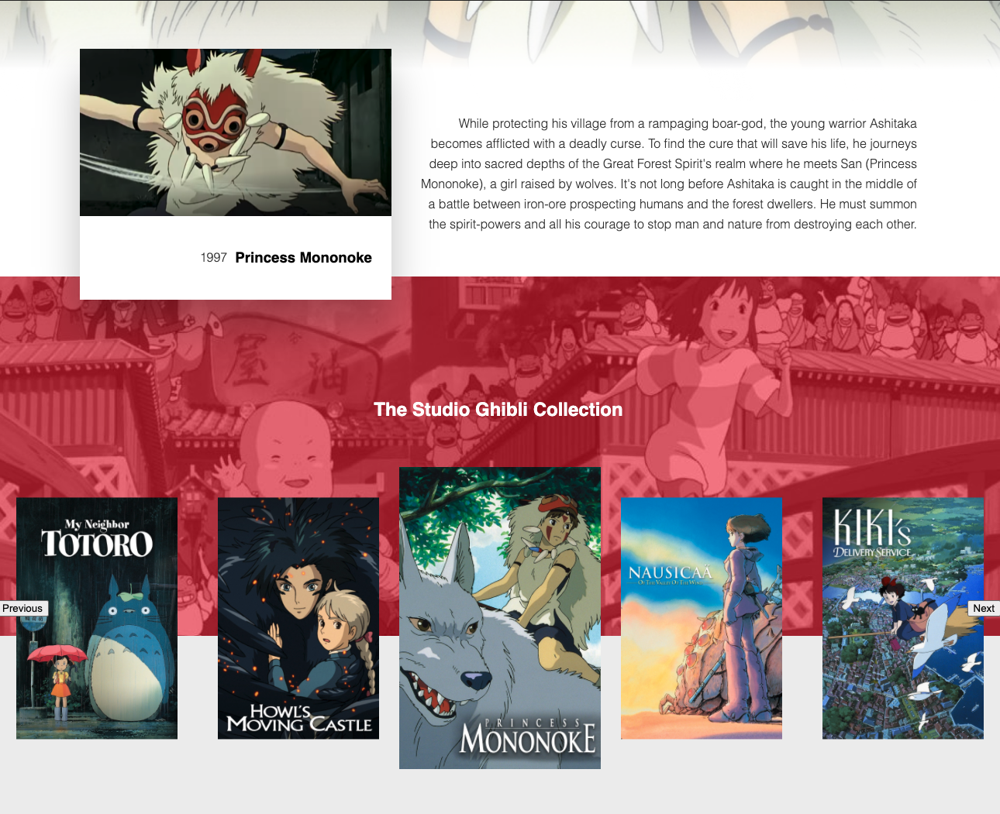

Studio Ghibli Movie Finder
=======
Created by Johnathan Blackburn
-----------

First Thoughts:
*Studio Ghibli type site using the free Ghibli API
*This will be a fully functional page
*It will be styled with modern ideas

# Techonlogies 

- HTML
- CSS
- JavaScript
- jQuery

# Screenshots

# Getting Started
[Click here](https://johnathanblackburncodes.github.io/ghibli-movie-finder/) to open app in browser

# Initial Roadmap
1. Set up repo on github - check
2. Get an API key from Ghibli API - check
3. Use AJAX function to make sure it is working - check
4. Use Figma to design the page - check
5. Markup the structure according to design - check
6. Tweak the design whenever I want to access a new attribute from the API - In Progress
7. Start styling the CSS
8. Responsive
9. Go over everything again and make sure it's TIGHT. That means - 
  *Short and organized HTML markup -
  *CSS should be in different files and link to main css file (this will help with organization) -
  *Short powerful functions would be ideal in Javascript. -
10. QA. Make sure to put yourself in the shoes of the user, test everything. -
11. profit -